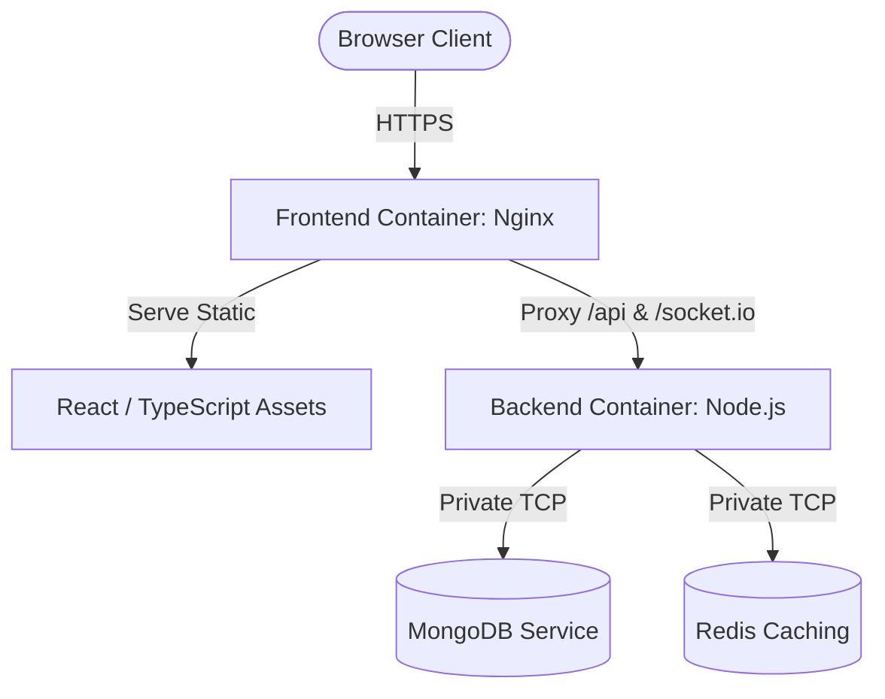

# 🚀 Railway Deployment Guide: Team Task Manager

This guide walks you through deploying the complete **Team Task Manager** application (MERN stack + Redis + Real-time Sockets) onto the [Railway](https://railway.app/) cloud platform.

We utilize **Docker containerization** for both services, leveraging Railway's native Dockerfile support, private networking, and database provisioning features.

---

## 🏗️ Architecture Overview

The system architecture in production leverages Railway's fast, zero-egress internal network:



> [!NOTE]
> By routing API requests through the Frontend's Nginx proxy (`/api`), we eliminate CORS problems completely and maintain secure, same-origin-style requests for the browser client.

---

## 🛠️ Step-by-Step Deployment

### Step 1: Push Code to GitHub
Ensure all your latest local changes, including our dynamic Nginx configuration, are pushed to your GitHub repository:
```bash
git add .
git commit -m "chore: configure dynamic backend url for production deployment"
git push origin main
```

---

### Step 2: Create a Railway Project & Provision Databases
1. Go to your [Railway Dashboard](https://railway.app/) and click **New Project** -> **Empty Project**.
2. **Add MongoDB**:
   - Click **+ New** (top-right of your project canvas).
   - Select **Database** -> **Add MongoDB**.
3. **Add Redis**:
   - Click **+ New**.
   - Select **Database** -> **Add Redis**.

---

### Step 3: Deploy the Backend Service
1. Click **+ New** -> **GitHub Repo** and select your `team-task-manager` repository.
2. Once the service is added, click on it, go to **Settings**, and configure:
   - **Service Name**: Change it to `backend` (this ensures its internal hostname will be `backend.railway.internal`).
   - **Root Directory**: Set this to `/backend`.
3. Go to the **Variables** tab of the `backend` service and click **New Variable** / **Raw Editor** to add the following variables:

| Variable Name | Value | Description |
|:---|:---|:---|
| `NODE_ENV` | `production` | Enables production optimizations |
| `PORT` | `5000` | Port the backend will listen on |
| `API_VERSION` | `v1` | Prefix version for routes |
| `MONGODB_URI` | `${{MongoDB.MONGODB_URL}}` | Automatically binds to your Railway MongoDB instance |
| `REDIS_URL` | `redis://default:${{Redis.REDIS_PASSWORD}}@${{Redis.REDIS_HOST}}:${{Redis.REDIS_PORT}}` | Binds to your Railway Redis instance |
| `JWT_SECRET` | *[Generate a 32+ character random string]* | Secret key for signing JWTs |
| `JWT_REFRESH_SECRET` | *[Generate another 32+ character random string]* | Secret key for signing refresh tokens |
| `CLIENT_URL` | `${{frontend.RAILWAY_PUBLIC_DOMAIN}}` | CORS origin authorization (references the frontend's domain) |

---

### Step 4: Deploy the Frontend Service
1. Click **+ New** -> **GitHub Repo** and select the same `team-task-manager` repository.
2. Go to **Settings** and configure:
   - **Service Name**: Change it to `frontend`.
   - **Root Directory**: Set this to `/frontend`.
3. Go to the **Variables** tab of the `frontend` service and add the following variable:

| Variable Name | Value | Description |
|:---|:---|:---|
| `BACKEND_URL` | `http://backend.railway.internal:5000` | Points to the backend service via Railway's private network |

4. Go to **Settings** -> **Networking** and click **Generate Domain** (or set up a custom domain) to expose the frontend publicly to users.

---

## ⚡ Verification & Database Seeding

### 1. Test the Services
- Open the generated public URL of the frontend in your browser.
- Open `/health` on the backend's public domain (e.g. `https://backend-production.up.railway.app/health`) to confirm that both server and MongoDB connections are functional.

### 2. Seed Initial Database Data
To populate the production database with initial seed data (admin and member users, default tasks):
1. Open the **backend** service in Railway.
2. Click the **Deployments** tab.
3. Click the vertical three dots next to the active deployment and select **Reference / Run Command** or open the **Railway CLI** locally in the `/backend` folder.
4. Alternatively, you can run the seed script locally pointing to the production database:
   ```bash
   # Run from your local /backend folder, substituting your production MONGODB_URI
   MONGODB_URI="mongodb://your-production-url" npm run seed
   ```

> [!WARNING]
> Running the seed script clears existing database entries. Ensure this is only executed during the initial setup phase.
